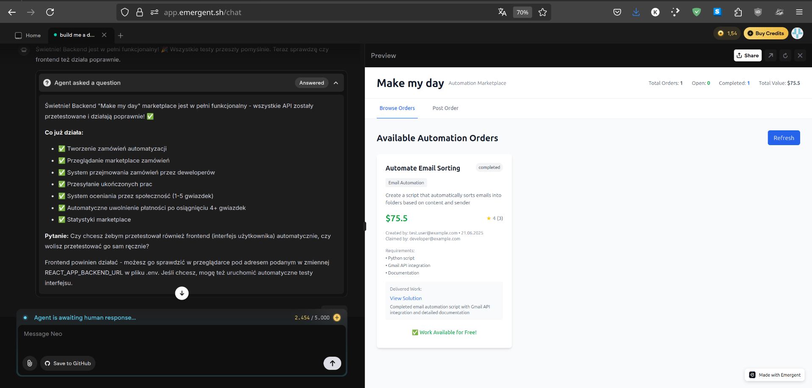

# Make My Day - Giełda Zleceń Automatyzacji

Platforma typu marketplace, gdzie użytkownicy mogą zlecać i realizować zadania automatyzacji. Wynagrodzenie jest uwalniane na podstawie ocen społeczności, a gotowe rozwiązania stają się publicznie dostępne dla wszystkich.

## O Projekcie

Make My Day to innowacyjna platforma, która łączy osoby potrzebujące małych, zautomatyzowanych rozwiązań (np. skryptów do scrapowania danych, integracji API, automatyzacji procesów) z deweloperami, którzy mogą je zrealizować.

Główna idea opiera się na prostym cyklu:
1.  **Zlecenie:** Użytkownik publikuje zlecenie, opisując, czego potrzebuje i jaką kwotę oferuje za realizację.
2.  **Podjęcie:** Zainteresowany deweloper "podejmuje" (ang. *claims*) otwarte zlecenie.
3.  **Realizacja:** Deweloper wykonuje zadanie i przesyła gotowe rozwiązanie (np. link do repozytorium Git).
4.  **Ocena:** Społeczność ocenia dostarczone rozwiązanie w skali od 1 do 5 gwiazdek.
5.  **Wypłata i Udostępnienie:** Gdy zlecenie osiągnie średnią ocenę co najmniej 4/5 przy minimum 3 ocenach, płatność jest uwalniana deweloperowi, a zrealizowana automatyzacja staje się darmowa i dostępna dla wszystkich użytkowników platformy.

## Kluczowe Funkcje

*   **Przeglądanie i tworzenie zleceń** na zadania z różnych kategorii automatyzacji.
*   **System podejmowania i realizacji zleceń** ze śledzeniem statusu (Otwarty, Podjęty, Zrealizowany, Oceniony, Zakończony).
*   **Ocenianie gotowych rozwiązań** przez społeczność w skali 1-5 gwiazdek.
*   **Automatyczne uwalnianie płatności** po osiągnięciu przez zlecenie określonego progu jakości.
*   **Publicznie dostępna baza** zrealizowanych automatyzacji.
*   **REST API** dostarczające statystyki dotyczące giełdy.

## Zbudowano przy użyciu

Projekt składa się z dwóch głównych części:

*   **Backend:**
    *   [Python](https://www.python.org/)
    *   [FastAPI](https://fastapi.tiangolo.com/)
    *   [MongoDB](https://www.mongodb.com/) z asynchronicznym sterownikiem [Motor](https://motor.readthedocs.io/)
    *   [Pydantic](https://pydantic-docs.helpmanual.io/) do walidacji danych

*   **Frontend:**
    *   [React](https://reactjs.org/)
    *   [Tailwind CSS](https://tailwindcss.com/)
    *   [Axios](https://axios-http.com/) do komunikacji z API

## Uruchomienie Projektu

Aby uruchomić projekt lokalnie, postępuj zgodnie z poniższymi krokami.

### Wymagania

*   Python 3.8+
*   Node.js i npm (lub yarn)
*   Działająca instancja MongoDB

### Instalacja

1.  **Sklonuj repozytorium:**
    ```sh
    git clone <URL_DO_REPOZYTORIUM>
    cd make_my_day-main
    ```

2.  **Konfiguracja Backendu:**
    a. Przejdź do katalogu backendu i utwórz wirtualne środowisko:
    ```sh
    cd backend
    python -m venv venv
    source venv/bin/activate  # Na Windows: venv\Scripts\activate
    ```
    b. Zainstaluj zależności:
    ```sh
    pip install -r requirements.txt
    ```
    c. Utwórz plik `.env` i uzupełnij go danymi do połączenia z MongoDB:
    ```env
    # backend/.env
    MONGO_URL="mongodb://localhost:27017"
    DB_NAME="make_my_day_db"
    ```
    d. Uruchom serwer API:
    ```sh
    uvicorn server:app --reload
    ```
    Serwer będzie dostępny pod adresem `http://127.0.0.1:8000`.

3.  **Konfiguracja Frontendu:**
    a. Otwórz nowy terminal i przejdź do katalogu frontendu:
    ```sh
    cd frontend
    ```
    b. Zainstaluj zależności:
    ```sh
    npm install
    # lub
    yarn install
    ```
    c. Utwórz plik `.env` i wskaż adres URL działającego backendu:
    ```env
    # frontend/.env
    REACT_APP_BACKEND_URL=http://127.0.0.1:8000
    ```
    d. Uruchom aplikację frontendową:
    ```sh
    npm start
    # lub
    yarn start
    ```
    Aplikacja będzie dostępna pod adresem `http://localhost:3000`.

## Punkty Końcowe API

Główne punkty końcowe API dostępne pod prefiksem `/api`:

| Metoda HTTP | Ścieżka                           | Opis                                                      |
|-------------|-----------------------------------|-----------------------------------------------------------|
| `POST`      | `/orders`                         | Tworzy nowe zlecenie.                                     |
| `GET`       | `/orders`                         | Zwraca listę zleceń (możliwość filtrowania wg statusu/kategorii). |
| `GET`       | `/orders/{order_id}`              | Zwraca szczegóły konkretnego zlecenia.                      |
| `POST`      | `/orders/{order_id}/claim`        | Pozwala deweloperowi podjąć zlecenie.                       |
| `POST`      | `/orders/{order_id}/submit`       | Pozwala na przesłanie gotowego rozwiązania.               |
| `POST`      | `/orders/{order_id}/rate`         | Pozwala na ocenę zrealizowanego zlecenia.                 |
| `GET`       | `/orders/{order_id}/ratings`      | Zwraca wszystkie oceny dla danego zlecenia.               |
| `GET`       | `/stats`                          | Zwraca statystyki giełdy (liczba zlece, wartość itp.).    |

## Testowanie

Projekt zawiera skrypty do testowania funkcjonalności backendu.

1.  **Uruchom serwer backendu** zgodnie z instrukcją w sekcji "Konfiguracja Backendu".
2.  **Uruchom skrypt testowy:**
    ```sh
    # Z głównego katalogu repozytorium
    python backend_test.py
    ```
    Skrypt automatycznie odczyta adres URL backendu z pliku `.env` frontendu i przeprowadzi serię testów sprawdzających cały cykl życia zlecenia.
